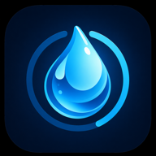
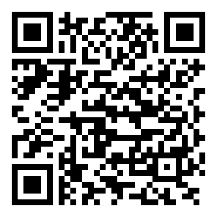
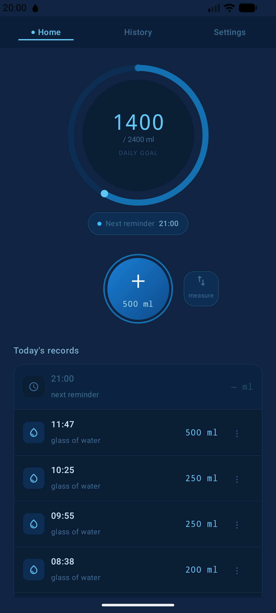
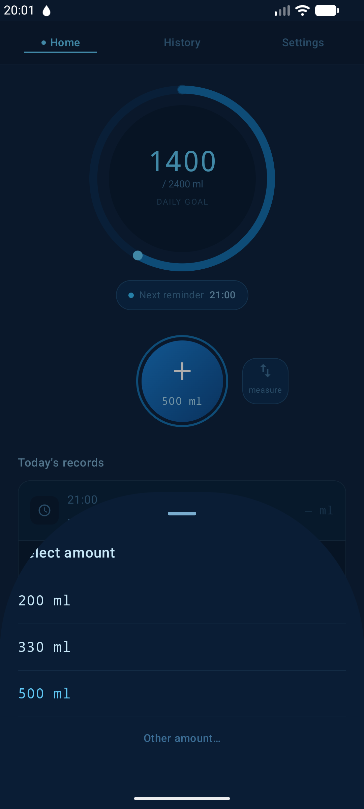
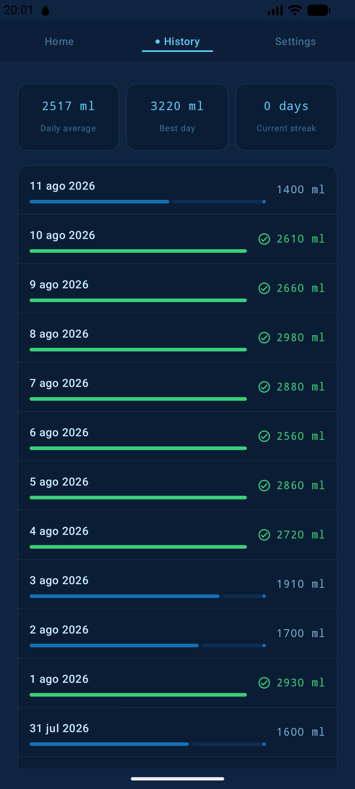
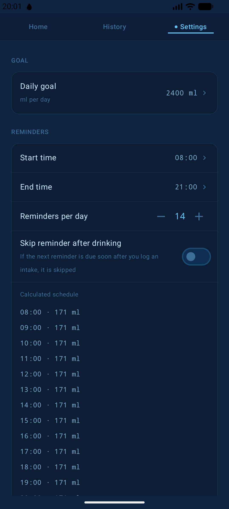
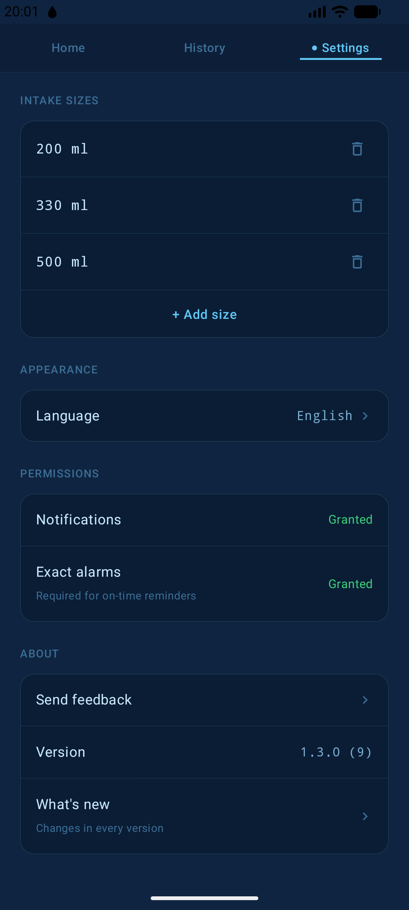
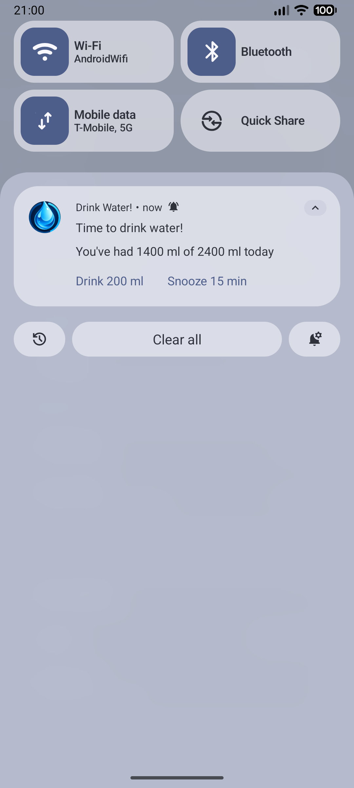
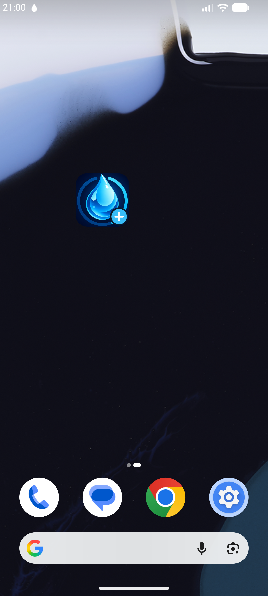

# Drink Water! · ¡Bebe agua!

<p align="center">
  
</p>

<p align="center">
  <strong>Track your daily water intake with one tap and get gentle reminders only when you need them.</strong><br/>
  No accounts. No cloud. No ads. No tracking.
</p>

<p align="center">
  <a href="https://play.google.com/store/apps/details?id=com.jjrapps.bebeagua">
    
  </a>
</p>

<p align="center">
  
  
  
  
  
  
  
</p>

---

## Overview

**Drink Water!** (*¡Bebe agua!* in Spanish) is a simple, beautiful Android app that helps you drink
enough water every day. Logging a glass takes a single tap, your progress is always visible in a
big ring, and reminders arrive only inside the hours you choose — and stop as soon as you reach
your goal.

Built 100% natively with **Kotlin**, **Jetpack Compose** and **Material 3**, with dynamic color that
matches your wallpaper. Everything stays on your device, and the code is open source under the
MIT License.

---

## 📲 Install

<table>
  <tr>
    <td align="center">
      <a href="https://play.google.com/store/apps/details?id=com.jjrapps.bebeagua">
        
      </a>
      <br/>
      <sub>Scan with your phone camera</sub>
    </td>
    <td>
      <ol>
        <li>Scan the QR code or open <a href="https://play.google.com/store/apps/details?id=com.jjrapps.bebeagua">Drink Water! on Google Play</a>.</li>
        <li>Tap <strong>Install</strong>. It's free, with no ads and no in-app purchases.</li>
        <li>Open the app, set your daily goal and your waking hours, and allow notifications.</li>
      </ol>
      <p>Requires <strong>Android 12</strong> or newer.</p>
    </td>
  </tr>
</table>

---

## 📸 Screenshots

<p align="center">
  
  
  
  
</p>
<p align="center">
  
  
  
</p>

---

## ✨ Features

### 💧 One-tap logging
- A big progress ring shows **consumed / goal** in ml at a glance.
- The main button logs your default amount — always the **last size you used**.
- Switch sizes from your own list, or enter **any other amount**.
- **Today's records** list with time and amount; delete any entry and the total updates.
- The next scheduled reminder is shown right on the home screen.

### ⏰ Reminders done right
- Only inside **your time window** (08:00–21:00 by default).
- Choose **how many reminders per day**; they're spread evenly and previewed in Settings.
- They **stop automatically** once you reach your daily goal.
- Logging water pushes the next reminder forward, so you're never nagged right after drinking.
- Optional **skip after drinking**: a reminder falling within a grace window (15 min by default)
  after an intake is skipped.
- **Vibrate, don't ring**: reminders vibrate silently, so your phone can stay in sound mode — and
  they reach your paired watch too.
- Exact alarms fire on time, even in battery-saving idle mode, and survive reboots.

### 🔔 Act from the notification
- **Drink X ml** logs your default amount without opening the app.
- **Snooze 15 min** when now isn't a good time.

### 🏠 Home screen widget
- A tiny **1x1 widget**: one tap logs your default amount and confirms with a toast
  (`+250 ml · 1250/2400 ml`). No need to open the app.

### 📊 History & streaks
- The last **30 days**, each with its total and progress bar against your goal.
- Daily average, best day and current **streak**.

### ⚙️ Make it yours
- Daily goal (2400 ml by default), time window and reminders per day.
- Editable list of intake sizes.
- **Language**: automatic, English or Spanish.
- **Theme**: automatic, light or dark, with Material You dynamic color.
- Permission status with direct shortcuts to system settings, including the notification channel.
- **What's new** screen with the full changelog, and **Send feedback** straight to the author.

### 🔒 100% offline & private
- No account, no sign-up, no cloud sync.
- Zero ads, zero analytics, zero trackers, zero third-party SDKs.
- Your records never leave your phone. Read the
  [privacy policy](https://jorgejiro.es/apps/bebe-agua/privacidad/).

---

## 🛠️ Tech Stack & Architecture

| Layer | Choice |
| :--- | :--- |
| Language | [Kotlin](https://kotlinlang.org/) 2.3 |
| UI | [Jetpack Compose](https://developer.android.com/jetpack/compose) + Material 3 (dynamic color) |
| Architecture | MVVM + Unidirectional Data Flow, layered `ui` / `domain` / `data` |
| Dependency injection | Hilt |
| Persistence | Room (intake records) + DataStore Preferences (settings) |
| Background | `AlarmManager.setExactAndAllowWhileIdle` + `BroadcastReceiver` |
| Widget | Jetpack Glance |
| Navigation | Navigation Compose |
| Concurrency | Coroutines + Flow |
| Tests | JUnit 4, MockK, Turbine, Compose UI Test |
| SDK | min 31 (Android 12) · target/compile 36 (Android 16) |

Technical decisions are recorded as lightweight ADRs in [`docs/decisions/`](docs/decisions/).

---

## 🚀 Building from Source

### Prerequisites
- **Android Studio** (recent stable) with its bundled JDK
- **Android SDK** 36

### Clone & build
```bash
git clone https://github.com/jorgejiro/bebe-agua-android.git
cd bebe-agua-android

# Debug APK → app/build/outputs/apk/debug/
./gradlew assembleDebug

# Lint + unit tests
./gradlew lint test
```

Release builds are signed with a private key that is not part of this repository.

---

## 📂 Project Structure

```
├── app/src/main/java/com/jjrapps/bebeagua/
│   ├── data/          # Room database, DataStore and repository implementations
│   ├── domain/        # Models, repository interfaces and use cases (pure Kotlin)
│   ├── di/            # Hilt modules
│   ├── reminder/      # Alarm scheduling, notification and boot receivers
│   ├── widget/        # Glance 1x1 widget
│   └── ui/            # Compose screens: home, history, settings, onboarding, changelog
├── docs/
│   ├── decisions/     # Architecture decision records
│   └── store-assets/  # Google Play screenshots and the pipeline that generates them
├── gradle/libs.versions.toml
└── CHANGELOG.md
```

---

## 📝 Changelog

See [CHANGELOG.md](CHANGELOG.md), also available inside the app under
**Settings → About → What's new**.

---

## 💬 Feedback

Found a bug or have an idea? Use **Settings → About → Send feedback** in the app, or
[open an issue](https://github.com/jorgejiro/bebe-agua-android/issues).
If you enjoy the app, a ⭐ review on
[Google Play](https://play.google.com/store/apps/details?id=com.jjrapps.bebeagua) helps a lot!

---

## 📄 License

This project is open source under the [MIT License](LICENSE).
Feel free to fork it, learn from it and adapt it. Contributions and feature requests are welcome.
